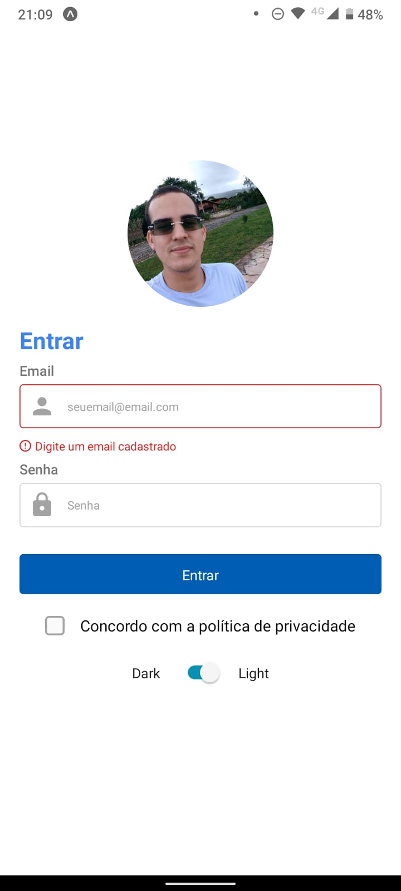
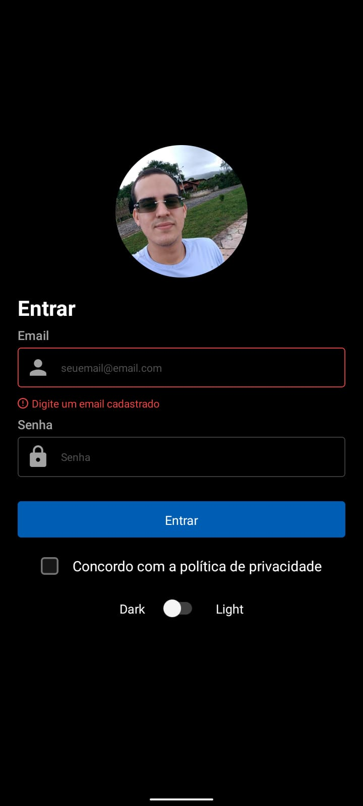

# Tela de login com React native

Um exercício de primeiro contato com React Native e Native Base através de aula da RocketSeat disponível em: 
  - [Utilizando UI Kit no React Native | Decode #030](https://www.youtube.com/watch?v=JEKZc_rkqgc)

Projeto finalizado: 

